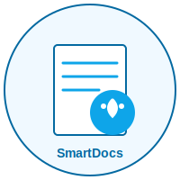

# SmartDocs

<p align="center">
  
</p>

An intelligent document editor powered by AI to help create, edit, and enhance documents with minimal effort.

## Overview

SmartDocs is a modern document editing application that combines the power of Anthropic's Claude AI with KendoReact components to create a seamless, intuitive writing experience. The app allows users to write and edit documents while leveraging AI assistance for content generation, refinement, and formatting.

## Features

### 🚀 Core Capabilities

- **Rich Text Editing**: Full-featured WYSIWYG document editor with formatting tools
- **AI-Assisted Writing**: Integrated Claude AI to help write, edit, and improve content
- **Intelligent Suggestions**: Get content recommendations based on your document context
- **Change Management**: Visualize and review AI suggestions before accepting them
- **Modern UI/UX**: Clean, responsive interface built with KendoReact components

### 💡 Smart Features

- **Real-time Collaboration**: Work with AI as your writing partner
- **Document Versioning**: Save and track document versions
- **Export Options**: Share your work in various formats
- **Custom Styling**: Format your documents with extensive styling options
- **Responsive Design**: Works seamlessly across devices

## Technology Stack

SmartDocs is built using a modern technology stack:

- **Framework**: [Next.js](https://nextjs.org/) (React-based framework)
- **UI Components**: [KendoReact](https://www.telerik.com/kendo-react-ui/) (Enterprise-grade React UI)
- **Styling**: [Tailwind CSS](https://tailwindcss.com/) for utility-first styling
- **AI Integration**: [Anthropic Claude](https://www.anthropic.com/) via API
- **TypeScript**: For type safety and developer experience

## KendoReact Components

SmartDocs leverages KendoReact's rich component library to deliver a professional document editing experience:

### Free Components

- **AppBar**: Main navigation and toolbar component for document actions
- **Avatar**: User profile representation in the application header
- **Button**: Action buttons throughout the interface
- **Input/TextArea**: Form inputs for document title and AI prompts
- **ProgressBar**: Visual feedback during AI processing
- **Popup**: Context menus and dropdown functionality
- **Splitter**: Resizable panels for editor and AI sidebar
- **Tooltip**: Contextual help and information

### Premium Components

- **Editor**: Rich text editing with comprehensive formatting tools
- **Dialog/Window**: Modal dialogs for help and settings
- **Notification**: System feedback notifications

## Architecture

SmartDocs follows a modular architecture:

1. **Document Editor**: Core editing experience using KendoReact Editor
2. **AI Sidebar**: Interface for interacting with Claude AI
3. **API Layer**: Backend services for AI communication and document processing
4. **State Management**: React state hooks for application state
5. **Component Library**: Custom and KendoReact components

## AI Integration

The application integrates with Anthropic's Claude AI through a custom API:

- **Prompt Engineering**: Specialized prompts for document editing
- **Response Processing**: Parsing XML-formatted changes from AI responses
- **Change Visualization**: Highlighting additions and deletions in the document
- **User Interaction**: Natural language interface for requests

## Getting Started

### Prerequisites

- Node.js 16+
- NPM or Yarn
- Anthropic API key

### Installation

1. Clone the repository
```bash
git clone https://github.com/your-username/smart-docs.git
cd smart-docs
```

2. Install dependencies
```bash
npm install
# or
yarn
```

3. Set up environment variables
```bash
# Create a .env file with your Anthropic API key
ANTHROPIC_API_KEY=your_api_key_here
```

4. Start the development server
```bash
npm run dev
# or
yarn dev
```

5. Open [http://localhost:3000](http://localhost:3000) in your browser

## Usage

1. **Creating a Document**: Click "New Document" on the home page
2. **Editing Content**: Use the rich text editor to write and format
3. **AI Assistance**: Type prompts in the AI sidebar to get help
4. **Reviewing Changes**: Accept or reject AI suggestions
5. **Saving Work**: Click "Save" to store your document

## Custom Components

SmartDocs extends KendoReact with custom components:

- **AISidebar**: Specialized interface for AI interaction
- **DocumentToolbar**: Context-aware editing tools
- **ProgressBar**: Enhanced loading indicator for AI processes
- **AppBar**: Navigation and document management header

## Future Roadmap

- Collaborative editing with multiple users
- Advanced document templates
- Offline support
- Mobile applications
- Enhanced AI capabilities

## Contributing

Contributions are welcome! Please feel free to submit a Pull Request.

## License

This project is licensed under the MIT License - see the LICENSE file for details.

## Acknowledgements

- KendoReact for the powerful UI components
- Anthropic for Claude AI capabilities
- Next.js team for the React framework
- All open-source contributors
